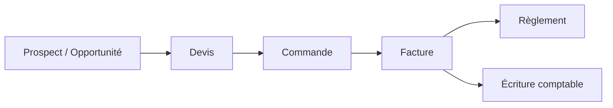
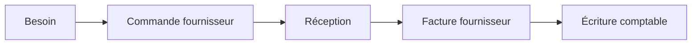

# Analyse métier (BRD)

*Business Requirements Document — besoins métier et règles de gestion*

## 1. Contexte métier

JAMPACK vise à outiller le cycle de gestion complet d'une TPE/PME : prospection, vente, facturation, encaissement, achats, stock et comptabilité. Le besoin central est la **continuité de l'information** — une même donnée (un client, un article, un montant) saisie une seule fois et réutilisée à chaque étape — couplée à la **conformité réglementaire** française.

## 2. Parties prenantes

| Partie prenante | Attentes principales |
|---|---|
| Dirigeant | Visibilité temps réel (CA, pipeline, trésorerie), pilotage multi-sociétés |
| Commercial | Suivi des affaires, devis rapides, historique client |
| Gestion / ADV | Facturation conforme, relances, suivi des règlements |
| Comptable | Écritures fiables issues de la gestion, TVA, FEC, clôture |
| Administrateur | Gestion des utilisateurs, des sociétés et des droits |
| Client final (de la PME) | Documents clairs, factures électroniques conformes |

## 3. Objectifs métier

- **OM-1** : réduire la double saisie entre CRM, ventes et comptabilité.
- **OM-2** : émettre et recevoir des factures électroniques conformes (Factur-X / PDP).
- **OM-3** : gérer plusieurs sociétés sous un même compte, avec cloisonnement et consolidation.
- **OM-4** : garantir l'exactitude et la traçabilité comptable (écritures, FEC, audit).
- **OM-5** : maîtriser les droits d'accès par personne et par société.

## 4. Processus métier cibles

### Cycle de vente

### Cycle d'achat

## 5. Règles de gestion (extrait)

| Réf. | Règle |
|---|---|
| RG-01 | Toute donnée de gestion appartient à **une société**, elle-même rattachée à **un compte**. |
| RG-02 | Un utilisateur n'accède qu'aux sociétés où il détient **au moins un rôle**. |
| RG-03 | Les **permissions effectives** dans une société sont l'**union** des rôles de l'utilisateur pour cette société. |
| RG-04 | La **comptabilité et la facturation** sont **cloisonnées par société** (numérotation, FEC propres à chaque société). |
| RG-05 | Un **numéro de facture** est unique, séquentiel et **insécable** au sein d'une société ; il est attribué à la **validation** de la pièce. |
| RG-06 | Un **client** peut avoir plusieurs **établissements** ; une adresse peut être de **facturation** et/ou de **livraison**. |
| RG-07 | Un tiers peut être **client**, **fournisseur**, ou les deux. |
| RG-08 | Le **taux de TVA** d'une ligne de facture est **figé** au moment de la facturation. |
| RG-09 | Les montants sont calculés **HT → TVA → TTC** ; jamais de perte de précision (décimal, pas de flottant). |
| RG-10 | Les données personnelles (contacts) sont traitées conformément au **RGPD** (hébergement UE, droit à l'effacement). |
| RG-11 | Le paramétrage se divise en deux : **paramètres globaux** (accès soumis à un droit) et **paramètres utilisateur** — chaque utilisateur modifie librement les informations propres à son compte (avatar, téléphone, nom d'affichage…). |
| RG-12 | Un utilisateur est **identifié de manière unique par son adresse e-mail**. |
| RG-13 | Un droit général **« Utilisateurs »** autorise à **voir / créer / modifier** les utilisateurs. |
| RG-14 | Un utilisateur créé n'est **jamais supprimé** : il est seulement basculé **actif / inactif**. Un utilisateur inactif ne peut plus se connecter mais son historique est conservé. |
| RG-15 | **Chaque action est soumise à un droit.** La hiérarchie des droits est **Rôle ▸ Module ▸ Domaine ▸ Action**, le **rôle** en étant le sommet. Les actions standard sont **voir / créer / modifier**. Un droit s'écrit `module.domaine.action` (ex. `ventes.factures.creer`) ; un rôle est l'ensemble des droits qu'il accorde. Les droits effectifs d'un utilisateur dans une société sont l'**union** de ses rôles pour cette société. |
| RG-16 | JAMPACK fournit des **rôles prédéfinis** prêts à l'emploi (Administrateur, Stock, Facturation, Comptable, Commercial, Lecture seule…). Ils sont utilisables tels quels, ou **duplicables et personnalisables** par compte. |
| RG-17 | **Au moins un utilisateur actif doit toujours détenir le rôle Administrateur** sur le compte. Le système empêche de retirer, désactiver ou rétrograder le **dernier** administrateur. |
| RG-18 | Un **administrateur peut voir, créer, modifier et activer/désactiver des rôles** (dont de nouveaux rôles personnalisés). Comme les utilisateurs, un rôle **n'est pas supprimé** mais basculé **actif/inactif** ; un rôle **inactif n'est plus attribuable** (les attributions existantes sont conservées mais gelées). Les **rôles prédéfinis** ne sont pas supprimables (ils peuvent être désactivés ou dupliqués). |
| **RG-19** | **Principe général : aucune donnée n'est supprimée physiquement dans l'ERP.** Tout enregistrement est **actif ou inactif** (archivé). L'action « supprimer » n'existe pas ; on **désactive/archive**. Un enregistrement inactif est masqué des listes et des sélections par défaut, ne peut plus être utilisé dans de nouvelles opérations, mais reste consultable et **conserve tout son historique** (traçabilité, audit, obligations comptables/légales). RG-14 (utilisateurs) et RG-18 (rôles) en sont des cas particuliers. |

## 6. Besoins par domaine

- **CRM** : centraliser tiers, contacts, établissements ; suivre les opportunités dans un pipeline ; historiser les activités.
- **Ventes** : produire devis → factures → avoirs ; calculer la TVA ; numéroter ; éditer en PDF ; émettre en électronique.
- **Achats** : commander aux fournisseurs, réceptionner, enregistrer les factures fournisseurs.
- **Stock** : suivre articles, entrepôts, mouvements et valorisation.
- **Comptabilité** : générer les écritures depuis la gestion, gérer la TVA, produire le FEC, clôturer.
- **Transverse** : administration des comptes/sociétés/utilisateurs/rôles, audit, paramétrage (TVA, numérotation, modèles de documents).

## 7. Hypothèses et dépendances

L'émission/réception des factures électroniques s'appuiera sur une **PDP agréée** (interface, non reconstruite). L'hébergement est **dans l'Union européenne** pour le RGPD. La comptabilité s'appuie sur des pièces de gestion déjà validées en amont.
