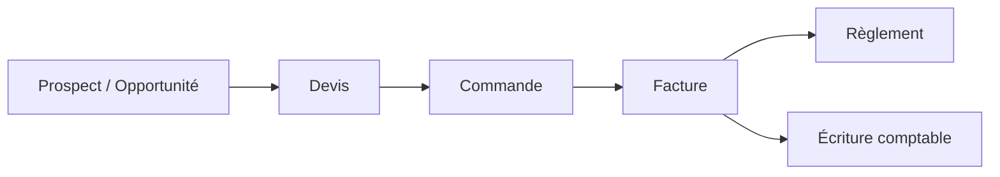

# Analyse métier (BRD)

*Business Requirements Document — besoins métier et règles de gestion*

## 1. Contexte métier

JAMPACK vise à outiller le cycle de gestion complet d'une TPE/PME : prospection, vente, facturation, encaissement, achats, stock et comptabilité. Le besoin central est la **continuité de l'information** — une même donnée (un client, un article, un montant) saisie une seule fois et réutilisée à chaque étape — couplée à la **conformité réglementaire** française.

## 2. Parties prenantes

| Partie prenante | Attentes principales |
|---|---|
| Dirigeant | Visibilité temps réel (CA, pipeline, trésorerie), pilotage multi-sociétés |
| Commercial | Suivi des affaires, devis rapides, historique client |
| Gestion / ADV | Facturation conforme, relances, suivi des règlements |
| Comptable | Écritures fiables issues de la gestion, TVA, FEC, clôture |
| Administrateur | Gestion des utilisateurs, des sociétés et des droits |
| Client final (de la PME) | Documents clairs, factures électroniques conformes |

## 3. Objectifs métier

- **OM-1** : réduire la double saisie entre CRM, ventes et comptabilité.
- **OM-2** : émettre et recevoir des factures électroniques conformes (Factur-X / PDP).
- **OM-3** : gérer plusieurs sociétés sous un même compte, avec cloisonnement et consolidation.
- **OM-4** : garantir l'exactitude et la traçabilité comptable (écritures, FEC, audit).
- **OM-5** : maîtriser les droits d'accès par personne et par société.

## 4. Processus métier cibles

### Cycle de vente

### Cycle d'achat

## 5. Règles de gestion (extrait)

| Réf. | Règle |
|---|---|
| RG-01 | Toute donnée de gestion appartient à **une société**, elle-même rattachée à **un compte**. |
| RG-02 | Un utilisateur n'accède qu'aux sociétés où il détient **au moins un rôle**. |
| RG-03 | Les **permissions effectives** dans une société sont l'**union** des rôles de l'utilisateur pour cette société. |
| RG-04 | La **comptabilité et la facturation** sont **cloisonnées par société** (numérotation, FEC propres à chaque société). |
| RG-05 | Un **numéro de facture** est unique, séquentiel et **insécable** au sein d'une société ; il est attribué à la **validation** de la pièce. |
| RG-06 | Un **client** peut avoir plusieurs **établissements** ; une adresse peut être de **facturation** et/ou de **livraison**. |
| RG-07 | Un tiers peut être **client**, **fournisseur**, ou les deux. |
| RG-08 | Le **taux de TVA** d'une ligne de facture est **figé** au moment de la facturation. |
| RG-09 | Les montants sont calculés **HT → TVA → TTC** ; jamais de perte de précision (décimal, pas de flottant). |
| RG-10 | Les données personnelles (contacts) sont traitées conformément au **RGPD** (hébergement UE, droit à l'effacement). |
| RG-11 | Le paramétrage se divise en deux : **paramètres globaux** (accès soumis à un droit) et **paramètres utilisateur** — chaque utilisateur modifie librement les informations propres à son compte (avatar, téléphone, nom d'affichage…). |
| RG-12 | Un utilisateur est **identifié de manière unique par son adresse e-mail**. |
| RG-13 | Un droit général **« Utilisateurs »** autorise à **voir / créer / modifier** les utilisateurs. |
| RG-14 | Un utilisateur créé n'est **jamais supprimé** : il est seulement basculé **actif / inactif**. Un utilisateur inactif ne peut plus se connecter mais son historique est conservé. |
| RG-15 | **Chaque action est soumise à un droit.** La hiérarchie des droits est **Rôle ▸ Module ▸ Domaine ▸ Action**, le **rôle** en étant le sommet. Les actions standard sont **voir / créer / modifier**. Un droit s'écrit `module.domaine.action` (ex. `ventes.factures.creer`) ; un rôle est l'ensemble des droits qu'il accorde. Les droits effectifs d'un utilisateur dans une société sont l'**union** de ses rôles pour cette société. |
| RG-16 | JAMPACK fournit des **rôles prédéfinis** prêts à l'emploi (Administrateur, Stock, Facturation, Comptable, Commercial, Lecture seule…). Ils sont utilisables tels quels, ou **duplicables et personnalisables** par compte. |
| RG-17 | **Au moins un utilisateur *actif* doit toujours détenir le rôle Administrateur (*actif*)** sur le compte. La vérification porte sur le **dernier administrateur actif** = un utilisateur *actif* possédant le rôle Administrateur *actif*. Le système **refuse** toute opération qui laisserait le compte sans administrateur actif, à savoir sur ce dernier : lui **retirer** le rôle Administrateur, le **mettre inactif** (utilisateur), ou **désactiver** le rôle Administrateur lui-même. |
| RG-18 | Un **administrateur peut voir, créer, modifier et activer/désactiver des rôles** (dont de nouveaux rôles personnalisés). Comme les utilisateurs, un rôle **n'est pas supprimé** mais basculé **actif/inactif** ; un rôle **inactif n'est plus attribuable** (les attributions existantes sont conservées mais gelées). Les **rôles prédéfinis** ne sont pas supprimables (ils peuvent être désactivés ou dupliqués). |
| **RG-19** | **Principe général : aucune donnée n'est supprimée physiquement dans l'ERP.** Tout enregistrement est **actif ou inactif** (archivé). L'action « supprimer » n'existe pas ; on **désactive/archive**. Un enregistrement inactif est masqué des listes et des sélections par défaut, ne peut plus être utilisé dans de nouvelles opérations, mais reste consultable et **conserve tout son historique** (traçabilité, audit, obligations comptables/légales). RG-14 (utilisateurs) et RG-18 (rôles) en sont des cas particuliers. |
| **RG-20** | **Principe général : toute action est tracée et historisée.** Chaque création, modification et changement de statut est enregistré dans un **journal d'audit inaltérable** : **qui** (utilisateur), **quoi** (entité, valeurs avant/après), **quand** (horodatage), dans **quelle société**. L'historique est consultable et ne peut être ni modifié ni effacé. |
| RG-21 | **Chaque action correspond à un droit**, présenté dans un **arbre des droits** (Rôle ▸ Module ▸ Domaine ▸ Action, chaque feuille étant **voir / créer / modifier**). Un droit peut être **générique** (accordé à un niveau parent — module ou domaine — il couvre tout son sous-arbre). Dans l'éditeur : **cocher un nœud sélectionne toute sa sous-hiérarchie** et le décocher la désélectionne ; un nœud dont seule une partie des descendants est cochée s'affiche en **état partiel (indéterminé)**. Les sélections partielles sont autorisées. |
| RG-22 | **Un droit peut porter plusieurs actions.** Un même droit accorde une ou plusieurs actions (**voir**, **créer**, **modifier**, plus les actions spécifiques éventuelles) sur un périmètre donné. Un droit générique applique ses actions à l'ensemble du sous-arbre concerné. |
| RG-23 | **Assistance IA optionnelle et transverse**, sur tout le périmètre et toute action/opportunité. Elle **propose** (n'applique jamais seule), n'est **jamais obligatoire**, est **soumise au droit** `ia.assistant.utiliser`, et **chaque appel est tracé** (avec son coût). Fournisseur **UE privilégié quand c'est possible**. |
| RG-24 | **Deux niveaux d'IA, classés selon le coût marginal pour l'éditeur JAMPACK.** Une fonction est **IA incluse (gratuite, sans crédit)** **uniquement si son coût marginal pour JAMPACK est nul** — règles métier, calculs, modèles locaux/open-source tournant sur l'infrastructure déjà provisionnée. Dès qu'une fonction engendre un **coût réel par appel** pour l'éditeur (API/inférence facturée), elle relève de l'**IA générative facturée aux crédits**. L'interface indique toujours si une action est incluse ou consomme des crédits. |
| RG-26 | L'**IA incluse est activée automatiquement et par défaut, partout où c'est techniquement possible *et à coût nul pour JAMPACK*** (contrôles, anomalies, scoring, suggestions, catégorisation, recherche sémantique…), sans action de l'utilisateur ni consommation de crédit. Elle fait partie du socle du produit. Un compte peut la désactiver mais elle est **présente d'origine**. |
| RG-27 | **L'IA est proposée partout où c'est techniquement possible *et* opérationnellement pertinent** (valeur réelle, fiabilité suffisante), sur tout le périmètre. Chaque usage est classé **inclus** (coût nul) ou **génératif** (crédits). La *Cartographie des usages IA* recense ces usages par module et sert de plan d'implémentation. |
| RG-28 | **Ouverture & interopérabilité maximales.** JAMPACK vise le **maximum de connecteurs** vers l'écosystème d'un ERP (bureautique, messagerie, drive, banque/DSP2, paiement, e-invoicing/PDP, compta, paie, e-commerce, signature, administrations FR, iPaaS…). Socle : **API publique + webhooks + architecture par adaptateurs + compatibilité iPaaS**. Priorité aux **standards ouverts** et fournisseurs **UE** ; chaque connecteur respecte les droits et est tracé. Voir *Connecteurs & intégrations*. |
| RG-25 | **Crédits IA** : **pool au niveau du compte + plafonds par utilisateur/rôle**. Le **coût estimé est affiché avant** exécution ; un appel refusé (droit/solde/plafond) ne consomme rien ; la **consommation est journalisée** de façon immuable. Recharge et plafonds relèvent de `ia.credits.gerer`. |
| **RG-29** | **Communication multicanale.** Au-delà de l'e-mail, JAMPACK peut émettre notifications, relances et messages via des canaux **conversationnels** (**WhatsApp Business**, **Slack**, **Microsoft Teams**, **Telegram**, **Signal**, **Messenger**, **SMS/RCS**, push). Chaque envoi est **soumis à un droit**, respecte le **consentement/opt-in** du destinataire (RGPD, règles propres à chaque canal) et est **journalisé** au journal d'audit ; les **réponses** entrantes peuvent être rattachées au CRM. Fournisseurs **UE privilégiés** quand c'est possible. |
| **RG-30** | **Modèles & champs de fusion.** JAMPACK fournit une **bibliothèque de modèles** (documents bureautiques **et** messages) alimentée par un **moteur unique**. Les **champs de fusion** sont **auto-remplis** depuis les données de l'ERP (tiers, contact, pièce, lignes, société, utilisateur, lien de paiement…) ; boucles et sections conditionnelles supportées ; un même modèle logique se décline en **document** (PDF/Word/ODT) ou en **message** (e-mail/WhatsApp/SMS). La **prévisualisation** (données réelles fusionnées) est requise avant génération/envoi. Les modèles ne sont **jamais supprimés** (actif/inactif, RG-19), sont **versionnés**, leur création/modification est **soumise à un droit** de paramétrage, et chaque génération/envoi est **tracé** (RG-20). |
| **RG-31** | **Plateforme adaptable.** Le client peut étendre l'ERP **sans développement** : **champs personnalisés**, **vues et statuts configurables** par objet (détaillés en **RG-35** et **RG-36**, voir *Personnalisation & champs personnalisés*). Un **moteur d'automatisations** (déclencheur → action) et des **workflows d'approbation** (devis, remises, achats, notes de frais) peuvent être configurés ; ils n'exécutent que des actions **déjà soumises aux droits** de l'auteur/mandant, et **chaque exécution est tracée** (RG-20). |
| **RG-32** | **Projets & facturation au temps.** Un **projet/affaire** regroupe temps, frais et pièces rattachées. La **facturation au temps passé / à l'avancement** s'appuie sur des **feuilles de temps validées** ; les **notes de frais** suivent un **circuit d'approbation** avant refacturation ou comptabilisation. Tout reste **cloisonné par société** (RG-04) et **tracé** (RG-20). |
| **RG-33** | **Accès externes (portails).** Un tiers externe (client, fournisseur) peut disposer d'un **accès self-service** limité aux **seules données de sa propre relation** (ses pièces, paiement de ses factures, signature de ses devis). Cet accès est **distinct des utilisateurs internes** et de leur RBAC, respecte le **cloisonnement par société** et la **traçabilité**, et n'autorise **aucune action** au-delà de son périmètre. |
| **RG-34** | **Sécurité & conservation renforcées.** JAMPACK prévoit **MFA/2FA**, politique de mot de passe, **chiffrement au repos** et **archivage à valeur probante** (NF203) pour les pièces. Ces mesures **ne contournent jamais** le principe de **non-suppression** (RG-19) ni la **piste d'audit inaltérable** (RG-20). |
| **RG-35** | **Personnalisation de l'affichage.** Chaque utilisateur adapte librement la **présentation** (colonnes affichées/ordre, tri, filtres, **vues enregistrées**, mise en page des fiches, tableau de bord) de façon **strictement personnelle** — sans modifier les données ni impacter autrui, en **self-service** (RG-11), **réversible** à tout moment. L'**administration peut créer des vues génériques** (modèles de vues) **partagées à tous ou par rôle**, servant de vue par défaut et **personnalisables** ensuite par chacun ; leur création/modification est **soumise à un droit de paramétrage**. Dans tous les cas, une vue **ne montre que les données et champs que l'utilisateur a le droit de voir** — elle n'élargit aucun droit. |
| **RG-36** | **Champs personnalisés.** Un utilisateur habilité (**droit de paramétrage**) peut **créer de nouveaux champs** sur un **domaine précis** (ex. table Contact), de **tout type** (texte, texte long, numérique, montant, pourcentage, booléen, date/heure, téléphone, e-mail, URL, liste de choix simple/multiple, relation/référentiel, fichier, adresse, calculé). Chaque champ a ses **propriétés** (obligatoire, valeur par défaut, unicité, validation, position) et est exploitable **partout comme un champ natif** (fiches, listes, filtres, recherche, import/export, **champs de fusion**, automatisations, rapports, API). Les **définitions** sont au niveau du **compte** ; les **valeurs** restent **cloisonnées par société** (RLS). La **visibilité/édition** d'un champ suit les **droits du domaine** (voir/créer/modifier) ; les champs ne sont **jamais supprimés** (actif/inactif, RG-19), sont **versionnés** et toute définition/valeur est **tracée** (RG-20). |
| **RG-37** | **Aide contextuelle & « how-to » intégrés.** À **tout moment**, sur chaque écran et chaque action, l'utilisateur peut accéder à une **explication claire** de **ce que fait l'action et comment la réaliser** (mini guides pas-à-pas). L'aide est **contextuelle** (liée à l'écran/action courant), **cherchable**, et **adaptée aux droits** (elle ne présente que les actions réellement accessibles à l'utilisateur). Elle sert le principe de **simplicité d'abord**. **Deux couches** : l'**aide de base** (guides pas-à-pas, FAQ, recherche) est **IA incluse** (coût nul, activée par défaut) ; par-dessus, un **assistant « comment faire… » en langage naturel** relève de l'**IA générative** (facturée aux **crédits**, **opt-in**, soumis au droit `ia.assistant.utiliser`, **coût affiché avant**, **tracé** — RG-23 à RG-25). Au-delà de l'explication, l'aide peut lancer un **parcours d'utilisation guidé** — une **visite interactive pas-à-pas** dans l'écran (mise en avant des champs, étape suivante) : **scriptée** (IA incluse) ou **adaptative** (IA générative). Dans tous les cas l'IA **explique et guide** ; **l'utilisateur exécute** chaque étape, dans la limite de ses droits. |
| **RG-38** | **Indépendance renforcée des sociétés (isolation en base).** Les données métier d'une société sont **isolées des autres sociétés du même compte au niveau de la base de données** (RLS **restrictif** sur `societeId`), et non par simple filtrage applicatif ; complète RG-01/RG-04. Restent **mutualisés au niveau compte** : l'annuaire des utilisateurs, les **définitions de rôles** et les **référentiels partagés** (TVA, étapes de pipeline). Entre **comptes**, l'isolation est **totale**. Une **vue consolidée** transverse (toutes les sociétés accessibles) reste possible pour un utilisateur habilité lorsqu'aucune société active n'est sélectionnée. |
| **RG-39** | **Import / export multi-canal.** Les données peuvent être importées/exportées par **plusieurs canaux** (fichiers CSV/Excel/ODS/JSON/XML, **API/webhooks**, **connecteurs**, e-mail, **iPaaS**), sur **tout le périmètre** (objets métier, **champs natifs et personnalisés**), avec **mapping réutilisable**, **prévisualisation**, **mode simulation**, **dédoublonnage/upsert** et traitement **par lots**. Chaque opération est **soumise aux droits** (par objet/action), respecte l'**isolation compte/société** (écriture dans la société active — RG-38) et est **tracée** (RG-20). L'export des données personnelles sert aussi le **droit d'accès / portabilité** RGPD. |
| **RG-40** | **Échange comptable (règles FR) & connexion bancaire.** L'ERP **importe et exporte** les données comptables conformément aux **règles françaises** : **FEC** (export **et** import, art. A47 A-1 du LPF), **PCG**, journaux, balances, et échange avec l'**expert-comptable** (FEC + formats des logiciels du marché : Sage, Cegid, Quadratus, EBP, Pennylane…). Il se **connecte à n'importe quelle banque** pour le **rapprochement** : **agrégation DSP2** (couverture FR/UE) complétée par l'import de relevés aux **formats standards** (**CAMT.053 ISO 20022**, **OFX**, **CFONB**, CSV). Les opérations sont **soumises aux droits**, **cloisonnées par société** (RG-38) et **tracées** (RG-20). L'**IA incluse** propose sur les vues concernées des **rapprochements/lettrages automatiques** (relevé ↔ écriture/facture), **toujours validés manuellement** (l'IA propose, ne valide jamais seule — RG-23). |
| **RG-41** | **Tous les documents sont personnalisables.** L'**intégralité** des documents produits par JAMPACK — devis, factures, avoirs, factures d'acompte, bons de commande/livraison, relances, courriers, e-mails, accusés, **états et exports**… — est personnalisable via le **moteur de modèles** (RG-30) : **mise en page**, **contenu**, **logo/branding**, **mentions légales/CGV**, **champs de fusion** et **sections conditionnelles**, **par société**. La gestion des modèles se fait **au niveau administration** (module **Administration** / **paramètres globaux**, RG-11), réservée aux profils habilités par un **droit de paramétrage** — ce n'est **pas** un réglage utilisateur individuel (à distinguer de la personnalisation d'affichage, RG-35). Les modèles sont **versionnés**, **jamais supprimés** (actif/inactif, RG-19) et **tracés** (RG-20). Des modèles par défaut prêts à l'emploi sont fournis (principe de **simplicité d'abord**). |

## 6. Besoins par domaine

- **CRM** : centraliser tiers, contacts, établissements ; suivre les opportunités dans un pipeline ; historiser les activités.
- **Ventes** : produire devis → factures → avoirs ; calculer la TVA ; numéroter ; éditer en PDF ; émettre en électronique.
- **Achats** : commander aux fournisseurs, réceptionner, enregistrer les factures fournisseurs.
- **Stock** : suivre articles, entrepôts, mouvements et valorisation.
- **Comptabilité** : générer les écritures depuis la gestion, gérer la TVA, produire le FEC, clôturer.
- **Transverse** : administration des comptes/sociétés/utilisateurs/rôles, audit, paramétrage (TVA, numérotation, modèles de documents).

## 7. Hypothèses et dépendances

L'émission/réception des factures électroniques s'appuiera sur une **PDP agréée** (interface, non reconstruite). L'hébergement est **dans l'Union européenne** pour le RGPD. La comptabilité s'appuie sur des pièces de gestion déjà validées en amont.
