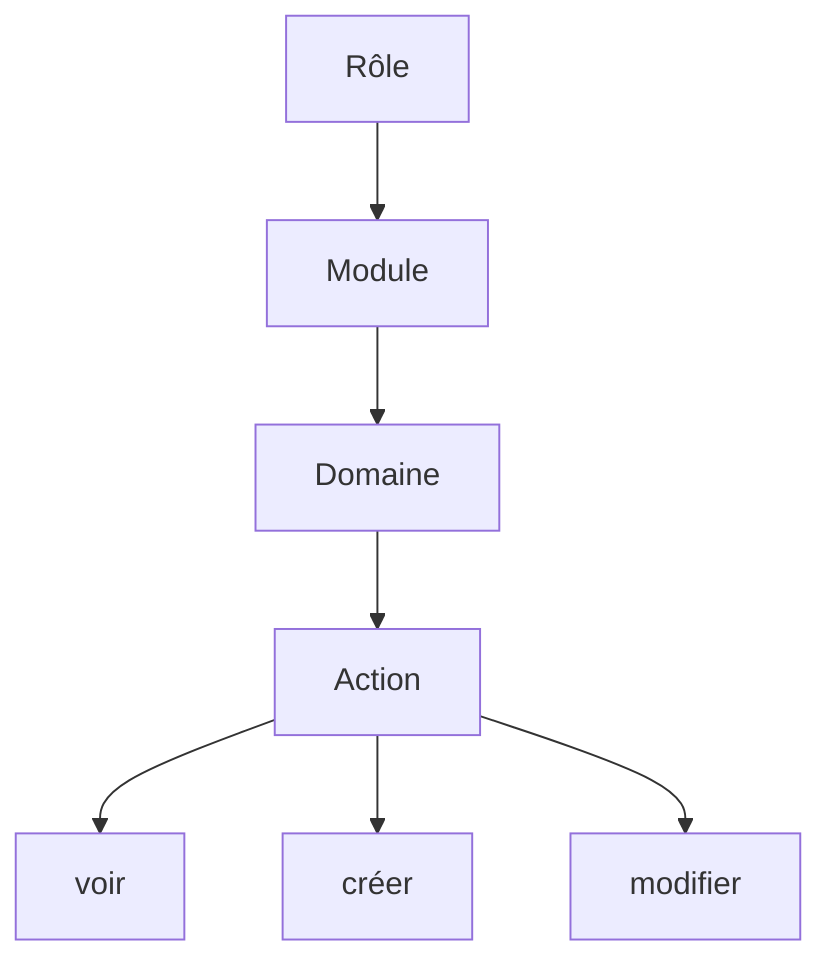
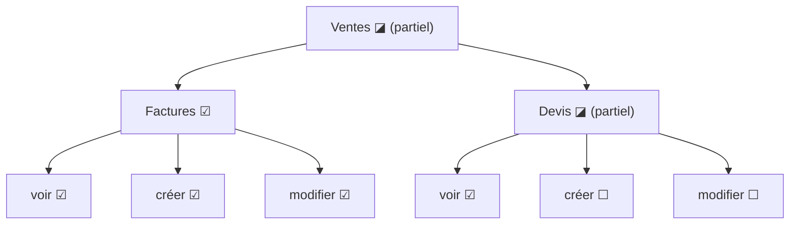

# Modèle d'habilitation & matrice des droits

## 1. Principe

L'accès aux fonctionnalités de JAMPACK repose sur un modèle de droits **hiérarchisé sur quatre niveaux**, le **rôle** au sommet :

- **Rôle** — sommet de la hiérarchie ; un ensemble nommé de droits (ex. *Commercial*, *Comptable*, *Admin*). Un rôle est attribué à un utilisateur **par société** et les rôles sont **cumulables**.
- **Module** — grand domaine fonctionnel (CRM, Ventes, Achats, Stock, Comptabilité, Référentiels, Administration).
- **Domaine** — objet de gestion au sein du module (ex. *Factures* dans *Ventes*).
- **Action** — opération soumise à droit ; actions standard **voir / créer / modifier**.

Un droit est identifié par le code **`module.domaine.action`** (ex. `ventes.factures.creer`).

## 2. Règles d'application

- **Chaque action sensible est soumise à un droit**, vérifié **côté serveur** ; l'interface masque ou désactive en plus les actions non autorisées.
- Les **droits effectifs** d'un utilisateur dans une société sont l'**union** des droits de ses rôles pour cette société.
- Au-delà des trois actions standard, certains domaines définissent des **actions spécifiques** (ex. `ventes.factures.valider`, `compta.fec.exporter`) soumises au même mécanisme.
- **Aucune action « supprimer » dans l'ERP** (principe général `RG-19` / `SRS-NF-DATA-1`) : partout, on **active/désactive** (archive). La bascule actif/inactif relève de l'action `modifier` du domaine concerné (ex. `admin.utilisateurs.modifier`, `admin.roles.modifier`).

## 3. Matrice des droits (modules ▸ domaines)

Chaque domaine expose au minimum les actions **voir · créer · modifier** (sauf mention).

| Module | Domaine | Code (préfixe) | Actions |
|---|---|---|---|
| **Administration** | Utilisateurs | `admin.utilisateurs` | voir · créer · modifier *(pas de suppression : actif/inactif)* |
| Administration | Rôles | `admin.roles` | voir · créer · modifier · activer/désactiver *(pas de suppression ; rôle inactif non attribuable)* |
| Administration | Sociétés | `admin.societes` | voir · créer · modifier |
| Administration | Compte | `admin.compte` | voir · modifier |
| **Paramètres** | TVA | `parametres.tva` | voir · créer · modifier |
| Paramètres | Numérotation | `parametres.numerotation` | voir · modifier |
| Paramètres | Modèles de documents | `parametres.modeles` | voir · créer · modifier |
| **CRM** | Clients / tiers | `crm.clients` | voir · créer · modifier |
| CRM | Contacts | `crm.contacts` | voir · créer · modifier |
| CRM | Établissements | `crm.etablissements` | voir · créer · modifier |
| CRM | Opportunités | `crm.opportunites` | voir · créer · modifier |
| CRM | Activités | `crm.activites` | voir · créer · modifier |
| **Ventes** | Devis | `ventes.devis` | voir · créer · modifier |
| Ventes | Factures | `ventes.factures` | voir · créer · modifier · *valider* |
| Ventes | Avoirs | `ventes.avoirs` | voir · créer · modifier |
| Ventes | Règlements | `ventes.reglements` | voir · créer · modifier |
| **Catalogue** | Articles & services | `catalogue.articles` | voir · créer · modifier |
| **Achats** | Fournisseurs | `achats.fournisseurs` | voir · créer · modifier |
| Achats | Commandes fournisseurs | `achats.commandes` | voir · créer · modifier |
| Achats | Réceptions | `achats.receptions` | voir · créer · modifier |
| Achats | Factures fournisseurs | `achats.factures` | voir · créer · modifier |
| **Stock** | Entrepôts | `stock.entrepots` | voir · créer · modifier |
| Stock | Mouvements | `stock.mouvements` | voir · créer · modifier |
| Stock | Inventaires | `stock.inventaires` | voir · créer · modifier |
| **Comptabilité** | Journaux | `compta.journaux` | voir · créer · modifier |
| Comptabilité | Écritures | `compta.ecritures` | voir · créer · modifier |
| Comptabilité | TVA | `compta.tva` | voir · *déclarer* |
| Comptabilité | FEC | `compta.fec` | voir · *exporter* |

*(Cette matrice s'étend au fil des modules livrés ; elle est la référence pour la configuration des rôles.)*

## 4. Rôles prédéfinis

JAMPACK est livré avec des **rôles prédéfinis** prêts à l'emploi. Ils sont utilisables tels quels ou **duplicables** pour créer des rôles personnalisés propres au compte.

| Rôle prédéfini | Droits accordés (résumé) |
|---|---|
| **Administrateur** | Tous les droits de tous les modules du compte, y compris Administration (utilisateurs, rôles, sociétés). |
| **Facturation** | CRM (voir), Catalogue (voir), Ventes (devis, factures, avoirs, règlements : voir/créer/modifier + valider). |
| **Stock** | Catalogue (voir/créer/modifier), Stock (entrepôts, mouvements, inventaires : voir/créer/modifier), Achats/Réceptions (voir/créer/modifier). |
| **Comptable** | Ventes & Achats (voir), Comptabilité (tous domaines), Paramètres/TVA (voir). |
| **Commercial** | CRM (tous domaines : voir/créer/modifier), Catalogue (voir), Ventes/Devis (voir/créer/modifier), Ventes/Factures (voir). |
| **Lecture seule** | Action *voir* sur les modules autorisés, aucune écriture. |

!!! warning "Invariant : toujours un administrateur"
    **Au moins un utilisateur actif doit toujours détenir le rôle Administrateur.** Le système **refuse** toute opération qui retirerait le rôle Administrateur au dernier administrateur, le désactiverait, ou le rétrograderait — avec un message explicite (`SRS-F-ADM-9`, `RG-17`).

## 5. Éditeur de rôle : l'arbre des droits

Les droits d'un rôle se configurent dans un **arbre à cases à cocher tri-état** :

- **Cascade** : cocher un nœud (module ou domaine) coche **tout son sous-arbre** ; le décocher le décoche entièrement.
- **État partiel** : un nœud dont seule une partie des descendants est cochée s'affiche **indéterminé** (◪).
- **Droit générique** : accorder un nœud parent équivaut à un droit couvrant tout le sous-arbre. On le note `module.*` (tout le module) ou `module.domaine.*` (toutes les actions du domaine) ; `*` = tous les droits (rôle Administrateur).
- **Multi-actions** : un même droit peut porter plusieurs actions (ex. `ventes.factures` → voir + créer + modifier).

À l'évaluation, un droit générique parent **implique** les droits enfants : disposer de `ventes.*` autorise `ventes.factures.creer`. C'est ce que fait le rôle **Administrateur** avec `*`.

## 6. Traçabilité

Ce modèle réalise les exigences `SRS-F-ADM-5/6/7/11/12` et les règles `RG-15`, `RG-21`, `RG-22`. Sa mise en œuvre technique (structure des rôles/droits, application côté serveur) est décrite dans le *Document d'architecture* et les *ADR* dédiés au contrôle d'accès.
